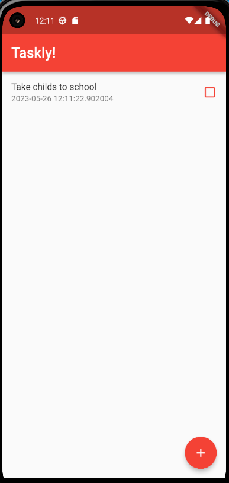
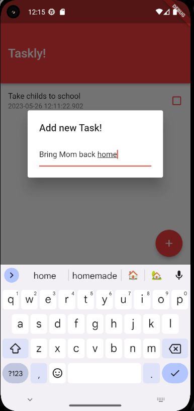
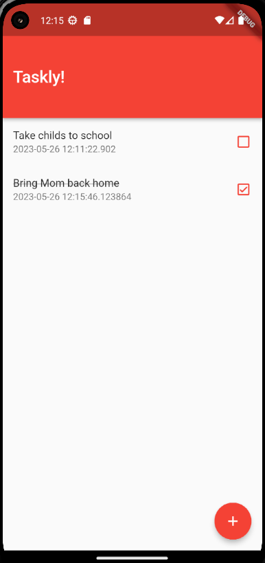

# taskly

A new Flutter project.

## Getting Started

This project is a starting point for a Flutter application.

Here in this Flutter App I put in practice some common widgets from the UI Material package, this is a to do app with all the CRUD functionalities using HIVE as database.

## Images
#### Main page

#### Adding new Tasks

